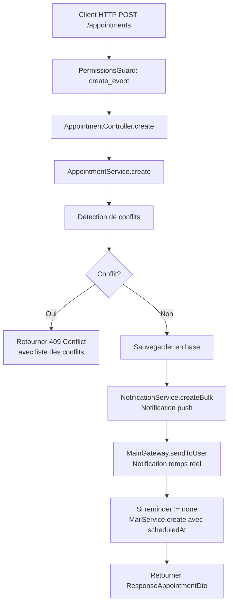
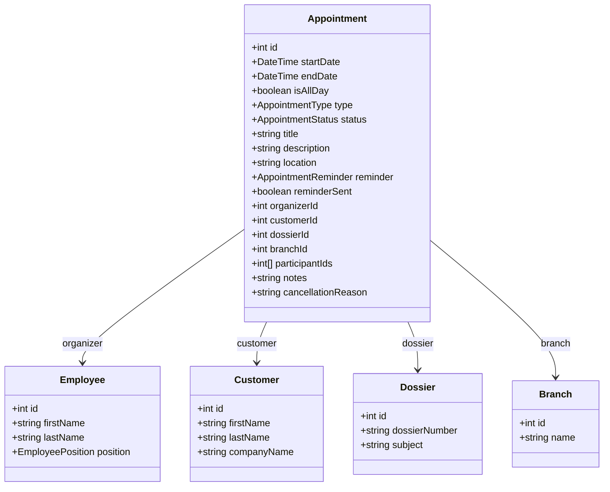

# Plan d'Architecture — Module de Gestion des Rendez-vous

## 1. Résumé

Ajout d'un module `Appointment` (rendez-vous) dans l'ERP du cabinet d'avocats.  
**Périmètre** : Rendez-vous client/avocat + réunions internes, CRUD complet, rappels (email + notification push), **pas** de synchronisation calendrier externe.

---

## 2. Structure du Module

```
src/modules/appointment/
├── appointment.module.ts
├── appointment.controller.ts
├── appointment.service.ts
├── appointment-stats.service.ts
├── appointment-write.handler.ts          # Pour AI Database
├── entities/
│   └── appointment.entity.ts
├── dto/
│   ├── create-appointment.dto.ts
│   ├── update-appointment.dto.ts
│   ├── search-appointment.dto.ts
│   └── response-appointment.dto.ts
├── enums/
│   └── appointment.enum.ts
└── seeder/
    └── appointment.seeder.ts             # Données de démo (optionnel)
```

---

## 3. Enum — AppointmentType & AppointmentStatus

```typescript
// src/modules/appointment/enums/appointment.enum.ts

export enum AppointmentType {
  CLIENT_MEETING    = 'client_meeting',     // Rendez-vous client
  INTERNAL_MEETING  = 'internal_meeting',   // Réunion interne
  PHONE_CALL        = 'phone_call',         // Appel téléphonique programmé
  VIDEO_CONFERENCE  = 'video_conference',   // Visioconférence
}

export enum AppointmentStatus {
  SCHEDULED   = 'scheduled',    // Planifié
  CONFIRMED   = 'confirmed',    // Confirmé
  IN_PROGRESS = 'in_progress',  // En cours
  COMPLETED   = 'completed',    // Terminé
  CANCELLED   = 'cancelled',    // Annulé
  NO_SHOW     = 'no_show',      // Client non présenté
}

export enum AppointmentReminder {
  NONE      = 'none',
  FIFTEEN   = '15min',
  THIRTY    = '30min',
  ONE_HOUR  = '1hour',
  TWO_HOURS = '2hours',
  ONE_DAY   = '1day',
}
```

---

## 4. Entité — Appointment

```typescript
// src/modules/appointment/entities/appointment.entity.ts

@Entity('appointments')
@BusinessTable({ name: 'appointments', description: 'Rendez-vous du cabinet' })
export class Appointment extends BaseEntity {
  @PrimaryGeneratedColumn()
  id: number;

  // ─── Informations temporelles ───
  @Column({ name: 'start_date', type: 'datetime' })
  @BusinessColumn({ label: 'Date et heure de début' })
  startDate: Date;

  @Column({ name: 'end_date', type: 'datetime' })
  @BusinessColumn({ label: 'Date et heure de fin' })
  endDate: Date;

  @Column({ name: 'is_all_day', type: 'boolean', default: false })
  isAllDay: boolean;

  // ─── Type et statut ───
  @Column({ type: 'enum', enum: AppointmentType })
  @BusinessColumn({ label: 'Type de rendez-vous' })
  type: AppointmentType;

  @Column({ type: 'enum', enum: AppointmentStatus, default: AppointmentStatus.SCHEDULED })
  @BusinessColumn({ label: 'Statut' })
  status: AppointmentStatus;

  // ─── Contenu ───
  @Column({ length: 255 })
  @BusinessColumn({ label: 'Titre / Objet' })
  title: string;

  @Column({ type: 'text', nullable: true })
  @BusinessColumn({ label: 'Description' })
  description: string;

  @Column({ name: 'location', length: 255, nullable: true })
  @BusinessColumn({ label: 'Lieu' })
  location: string;

  // ─── Rappel ───
  @Column({ type: 'enum', enum: AppointmentReminder, default: AppointmentReminder.THIRTY })
  @BusinessColumn({ label: 'Rappel' })
  reminder: AppointmentReminder;

  @Column({ name: 'reminder_sent', type: 'boolean', default: false })
  reminderSent: boolean;

  // ─── Relations ───
  @ManyToOne(() => Employee, { nullable: true })
  @JoinColumn({ name: 'organizer_id' })
  @BusinessColumn({ label: 'Organisateur' })
  organizer: Employee;
  @Column({ name: 'organizer_id', type: 'int', nullable: true })
  organizerId: number;

  @ManyToOne(() => Customer, { nullable: true })
  @JoinColumn({ name: 'customer_id' })
  @BusinessColumn({ label: 'Client' })
  customer: Customer;
  @Column({ name: 'customer_id', type: 'int', nullable: true })
  customerId: number;

  @ManyToOne(() => Dossier, { nullable: true })
  @JoinColumn({ name: 'dossier_id' })
  @BusinessColumn({ label: 'Dossier associé' })
  dossier: Dossier;
  @Column({ name: 'dossier_id', type: 'int', nullable: true })
  dossierId: number;

  @ManyToOne(() => Branch, { nullable: true })
  @JoinColumn({ name: 'branch_id' })
  @BusinessColumn({ label: 'Agence' })
  branch: Branch;
  @Column({ name: 'branch_id', type: 'int', nullable: true })
  branchId: number;

  // ─── Participants (réunions internes) ───
  @Column({ name: 'participant_ids', type: 'json', nullable: true })
  participantIds: number[];  // Liste d'IDs Employee

  // ─── Notes de suivi ───
  @Column({ name: 'notes', type: 'text', nullable: true })
  notes: string;

  @Column({ name: 'cancellation_reason', type: 'text', nullable: true })
  cancellationReason: string;

  // ─── Timestamps ───
  @CreateDateColumn({ name: 'created_at' })
  createdAt: Date;

  @UpdateDateColumn({ name: 'updated_at' })
  updatedAt: Date;
}
```

---

## 5. DTOs

### 5.1 CreateAppointmentDto

```typescript
export class CreateAppointmentDto {
  @IsDateString()
  startDate: Date;

  @IsDateString()
  endDate: Date;

  @IsOptional()
  @IsBoolean()
  isAllDay?: boolean;

  @IsEnum(AppointmentType)
  type: AppointmentType;

  @IsString()
  @MaxLength(255)
  title: string;

  @IsOptional()
  @IsString()
  description?: string;

  @IsOptional()
  @IsString()
  @MaxLength(255)
  location?: string;

  @IsOptional()
  @IsEnum(AppointmentReminder)
  reminder?: AppointmentReminder;

  @IsOptional()
  @IsInt()
  organizerId?: number;

  @IsOptional()
  @IsInt()
  customerId?: number;

  @IsOptional()
  @IsInt()
  dossierId?: number;

  @IsOptional()
  @IsInt()
  branchId?: number;

  @IsOptional()
  @IsArray()
  @IsInt({ each: true })
  participantIds?: number[];
}
```

### 5.2 UpdateAppointmentDto

Mêmes champs que `CreateAppointmentDto` mais tous optionnels, avec en plus :
- `status?: AppointmentStatus`
- `notes?: string`
- `cancellationReason?: string`

### 5.3 SearchAppointmentDto

```typescript
export class SearchAppointmentDto {
  @IsOptional()
  @IsDateString()
  startDateFrom?: Date;

  @IsOptional()
  @IsDateString()
  startDateTo?: Date;

  @IsOptional()
  @IsEnum(AppointmentType)
  type?: AppointmentType;

  @IsOptional()
  @IsEnum(AppointmentStatus)
  status?: AppointmentStatus;

  @IsOptional()
  @IsInt()
  organizerId?: number;

  @IsOptional()
  @IsInt()
  customerId?: number;

  @IsOptional()
  @IsInt()
  dossierId?: number;

  @IsOptional()
  @IsInt()
  branchId?: number;

  @IsOptional()
  @IsString()
  search?: string;  // Recherche plein texte sur title, description

  @IsOptional()
  @IsInt()
  page?: number;

  @IsOptional()
  @IsInt()
  limit?: number;
}
```

### 5.4 ResponseAppointmentDto

DTO de réponse avec `@Expose()` / `@Transform()` pour exposer les relations simplifiées (nom du client, nom de l'organisateur, etc.).

---

## 6. Service — AppointmentService

### Méthodes principales

| Méthode | Description |
|---|---|
| `create(dto, userId)` | Crée un rendez-vous + notifie les participants |
| `findAll(query)` | Recherche paginée avec filtres |
| `findOne(id)` | Détail d'un rendez-vous |
| `update(id, dto, userId)` | Mise à jour + notification aux participants |
| `remove(id, userId)` | Suppression logique (ou physique) |
| `confirm(id, userId)` | Confirmer un rendez-vous |
| `cancel(id, reason, userId)` | Annuler avec motif |
| `markInProgress(id, userId)` | Marquer "En cours" |
| `markCompleted(id, userId)` | Marquer "Terminé" |
| `markNoShow(id, userId)` | Marquer "Non présenté" |
| `getUserAgenda(userId, dateFrom, dateTo)` | Agenda d'un utilisateur sur une période |
| `getAgendaByBranch(branchId, dateFrom, dateTo)` | Agenda d'une agence |
| `checkConflicts(employeeId, startDate, endDate, excludeId?)` | Détection de conflits |

### Détection de conflits

```typescript
async checkConflicts(
  employeeId: number,
  startDate: Date,
  endDate: Date,
  excludeId?: number,
): Promise<Appointment[]> {
  const query = this.appointmentRepo.createQueryBuilder('appointment')
    .where('appointment.organizer_id = :employeeId', { employeeId })
    .andWhere('appointment.status NOT IN (:...excludedStatuses)', {
      excludedStatuses: [AppointmentStatus.CANCELLED, AppointmentStatus.COMPLETED],
    })
    .andWhere('appointment.start_date < :endDate', { endDate })
    .andWhere('appointment.end_date > :startDate', { startDate });

  if (excludeId) {
    query.andWhere('appointment.id != :excludeId', { excludeId });
  }

  return query.getMany();
}
```

### Système de rappels

Un cron (`@Cron(CronExpression.EVERY_MINUTE)`) dans le service :

```typescript
@Cron(CronExpression.EVERY_MINUTE)
async handleReminders() {
  const now = new Date();
  const upcoming = await this.appointmentRepo.find({
    where: {
      reminderSent: false,
      status: In([AppointmentStatus.SCHEDULED, AppointmentStatus.CONFIRMED]),
    },
    relations: ['organizer', 'customer', 'dossier'],
  });

  for (const appointment of upcoming) {
    const reminderDate = this.calculateReminderDate(appointment);
    if (reminderDate && now >= reminderDate) {
      await this.sendReminder(appointment);
      appointment.reminderSent = true;
      await this.appointmentRepo.save(appointment);
    }
  }
}
```

**Envoi du rappel** combine :
1. **Notification push** via `NotificationService.createBulk()` avec un nouveau type `APPOINTMENT_REMINDER`
2. **Email** via `MailService.create()` avec `scheduledAt` pour programmation
3. **Socket** via `MainGateway.sendToUser()` pour notification temps réel

---

## 7. Controller — AppointmentController

| Méthode | Endpoint | Permission | Description |
|---|---|---|---|
| POST | `/appointments` | `create_event` | Créer un rendez-vous |
| GET | `/appointments` | `view_agenda` | Lister les rendez-vous (filtrés) |
| GET | `/appointments/:id` | `view_agenda` | Détail d'un rendez-vous |
| PATCH | `/appointments/:id` | `edit_event` | Modifier un rendez-vous |
| DELETE | `/appointments/:id` | `delete_event` | Supprimer un rendez-vous |
| PATCH | `/appointments/:id/confirm` | `edit_event` | Confirmer |
| PATCH | `/appointments/:id/cancel` | `edit_event` | Annuler |
| PATCH | `/appointments/:id/in-progress` | `edit_event` | En cours |
| PATCH | `/appointments/:id/complete` | `edit_event` | Terminer |
| PATCH | `/appointments/:id/no-show` | `edit_event` | Non présenté |
| GET | `/appointments/agenda/mine` | `view_agenda` | Mon agenda |
| GET | `/appointments/agenda/branch/:branchId` | `view_all_agendas` | Agenda d'une agence |
| GET | `/appointments/check-conflicts` | `create_event` | Vérifier les conflits |

---

## 8. Write Handler — AppointmentWriteHandler (AI Database)

```typescript
@Injectable()
export class AppointmentWriteHandler extends BaseWriteHandler {
  constructor(
    dataSource: DataSource,
    schemaMetadata: SchemaMetadataService,
    entityResolver: EntityResolverService,
    @InjectRepository(Appointment)
    private readonly appointmentRepo: Repository<Appointment>,
  ) {
    super('appointments', dataSource, schemaMetadata, entityResolver);
  }

  async getWriteableFieldsSchema(): Promise<WriteableFieldSchema[]> {
    const fields = await super.getWriteableFieldsSchema();
    // Enrichir les descriptions pour l'IA
    return fields;
  }

  async validateFields(fields, operation): Promise<ValidationResult> {
    const errors: string[] = [];
    if (!fields.start_date) errors.push('La date de début est obligatoire');
    if (!fields.end_date) errors.push('La date de fin est obligatoire');
    if (fields.start_date && fields.end_date && new Date(fields.start_date) >= new Date(fields.end_date)) {
      errors.push('La date de fin doit être postérieure à la date de début');
    }
    if (!fields.title) errors.push('Le titre est obligatoire');
    return { valid: errors.length === 0, errors, transformedFields: fields };
  }

  protected async doInsert(fields, userId): Promise<WriteResult> {
    // Résoudre les relations (organizer -> employee, customer, dossier, branch)
    // via entityResolver.resolve()
    return super.doInsert(fields, userId);
  }
}
```

---

## 9. Intégration avec les modules existants

### 9.1 Permissions (déjà existantes dans [`Permission`](src/core/enums/permission.enum.ts:78-83))

| Permission | Usage |
|---|---|
| `view_agenda` | Voir son propre agenda |
| `create_event` | Créer un rendez-vous |
| `edit_event` | Modifier un rendez-vous |
| `delete_event` | Supprimer un rendez-vous |
| `view_all_agendas` | Voir l'agenda de tous (admin, chef d'agence) |

Ces permissions sont déjà seedées dans [`role.seeder.ts`](src/core/auth/seeders/role.seeder.ts:38) pour tous les rôles.

### 9.2 Notification

Ajouter dans [`NotificationType`](src/modules/notification/enum/notification-type.enum.ts:2) :
```typescript
APPOINTMENT_CREATED  = 'appointment_created',
APPOINTMENT_UPDATED  = 'appointment_updated',
APPOINTMENT_CANCELLED = 'appointment_cancelled',
APPOINTMENT_REMINDER  = 'appointment_reminder',
```

### 9.3 Email

Réutiliser [`MailService.create()`](src/core/shared/services/email/email.service.ts:22) avec `scheduledAt` pour programmer les emails de rappel.

### 9.4 Socket

Réutiliser [`MainGateway.sendToUser()`](src/core/shared/services/socket/main.gateway.ts:783) pour les notifications temps réel.

### 9.5 Relations avec les entités existantes

- [`Employee`](src/modules/agencies/employee/entities/employee.entity.ts:44) → `organizer` (organisateur)
- [`Customer`](src/modules/customer/customer/entities/customer.entity.ts:42) → `customer` (client concerné)
- [`Dossier`](src/modules/dossiers/entities/dossier.entity.ts:48) → `dossier` (dossier associé)
- [`Branch`](src/modules/agencies/branch/entities/branch.entity.ts:18) → `branch` (agence)

---

## 10. Diagramme de flux — Création d'un rendez-vous



## 11. Diagramme de flux — Rappel automatique

```mermaid
flowchart TD
    A[Cron EVERY_MINUTE] --> B[AppointmentService.handleReminders]
    B --> C[Requête: appointments<br>reminderSent=false<br>status=SCHEDULED|CONFIRMED]
    C --> D[Pour chaque appointment]
    D --> E[Calculer reminderDate]
    E --> F{now >= reminderDate?}
    F -->|Non| D
    F -->|Oui| G[NotificationService.createBulk<br>type=APPOINTMENT_REMINDER]
    G --> H[MainGateway.sendToUser<br>event=new_notification]
    H --> I[Si email reminder configuré<br>MailService.create]
    I --> J[Marquer reminderSent=true]
    J --> D
```

## 12. Diagramme de classes



---

## 13. Ordre d'implémentation

1. **Enum** [`appointment.enum.ts`](src/modules/appointment/enums/appointment.enum.ts) — Types, statuts, rappels
2. **Entité** [`appointment.entity.ts`](src/modules/appointment/entities/appointment.entity.ts) — Avec décorateurs `@BusinessTable`/`@BusinessColumn`
3. **DTOs** — Create, Update, Search, Response
4. **Service** [`appointment.service.ts`](src/modules/appointment/appointment.service.ts) — CRUD + conflits + rappels
5. **Stats Service** [`appointment-stats.service.ts`](src/modules/appointment/appointment-stats.service.ts) — Statistiques (optionnel)
6. **Controller** [`appointment.controller.ts`](src/modules/appointment/appointment.controller.ts) — Endpoints REST
7. **Module** [`appointment.module.ts`](src/modules/appointment/appointment.module.ts) — Déclaration NestJS
8. **Write Handler** [`appointment-write.handler.ts`](src/modules/appointment/appointment-write.handler.ts) — Intégration AI Database
9. **Seeder** [`appointment.seeder.ts`](src/modules/appointment/seeder/appointment.seeder.ts) — Données de démo
10. **Enregistrement** dans [`app.module.ts`](src/app.module.ts:71) — Importer `AppointmentModule`
11. **Ajout des types** dans [`NotificationType`](src/modules/notification/enum/notification-type.enum.ts:2) — Nouveaux types de notification
12. **Migration** TypeORM — Générer la migration pour la table `appointments`
