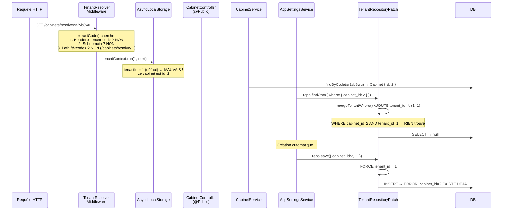
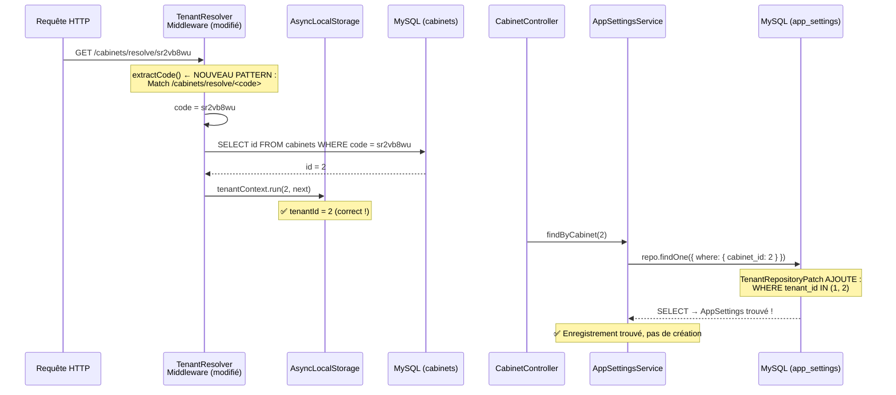

# Plan de correction : Erreur `Duplicate entry` sur `GET /cabinets/resolve/:code`

## Résumé du problème

L'appel `GET /cabinets/resolve/sr2vb8wu` retourne :
```json
{ "statusCode": 500, "message": "Duplicate entry '2' for key 'IDX_9c5bbaf33723ba02c1989caa20'" }
```

## Cause racine



**Le problème :** [`TenantResolverMiddleware`](src/core/tenant/tenant-resolver.middleware.ts:67-70) ne reconnaît pas le pattern `/cabinets/resolve/:code`. Il ne trouve donc pas de code tenant et utilise `tenantId = 1` par défaut. Ensuite, le [`TenantRepositoryPatch`](src/core/tenant/tenant-repository.patch.ts) filtre la lecture par `tenant_id = 1`, ce qui cache l'enregistrement existant (qui a `tenant_id = 2`).

## Solution retenue : Étendre `TenantResolverMiddleware.extractCode()`

### Principe

Ajouter un 4e pattern de résolution dans [`extractCode()`](src/core/tenant/tenant-resolver.middleware.ts:52-72) pour qu'il reconnaisse les routes publiques contenant un code cabinet :

```typescript
// 4. Path /cabinets/resolve/:code — route publique de résolution
const resolveMatch = req.path.match(/^\/cabinets\/resolve\/([a-z0-9]+)(\/|$)/);
if (resolveMatch) return resolveMatch[1];
```

Ainsi, toute requête vers `/cabinets/resolve/sr2vb8wu` résoudra correctement `tenantId = 2` dans l'`AsyncLocalStorage`, et le `TenantRepositoryPatch` pourra trouver l'enregistrement `AppSettings` existant.

### Diagramme de la solution



### Fichier modifié

| Fichier | Modification |
|---------|-------------|
| [`src/core/tenant/tenant-resolver.middleware.ts`](src/core/tenant/tenant-resolver.middleware.ts:52-72) | Ajouter le pattern `/cabinets/resolve/:code` dans `extractCode()` |

### Code à ajouter

Dans [`extractCode()`](src/core/tenant/tenant-resolver.middleware.ts:67-70), après la condition `// 3. Path /t/<code>/...`, ajouter :

```typescript
// 4. Path /cabinets/resolve/:code — résolution publique de cabinet
const resolveMatch = req.path.match(/^\/cabinets\/resolve\/([a-z0-9]+)(\/|$)/);
if (resolveMatch) return resolveMatch[1];
```

### Nettoyage base de données

Après le déploiement du fix, exécuter ce script SQL pour supprimer les doublons créés par le bug :

```sql
-- Voir les doublons
SELECT cabinet_id, COUNT(*) as cnt, GROUP_CONCAT(id) as ids 
FROM app_settings 
GROUP BY cabinet_id 
HAVING cnt > 1;

-- Supprimer les doublons (garder le premier enregistrement)
DELETE FROM app_settings 
WHERE id IN (
    SELECT id FROM (
        SELECT s2.id 
        FROM app_settings s2
        INNER JOIN (
            SELECT cabinet_id, MIN(id) as min_id 
            FROM app_settings 
            GROUP BY cabinet_id 
            HAVING COUNT(*) > 1
        ) dup ON s2.cabinet_id = dup.cabinet_id AND s2.id > dup.min_id
    ) tmp
);
```

## Test de validation

1. Redémarrer l'application
2. Tester `GET /cabinets/resolve/sr2vb8wu` → doit retourner `{ data: { id: 2, name, logo, slogan, ... }, found: true }`
3. Tester avec un code inexistant → doit retourner `{ found: false }`
4. Vérifier qu'il n'y a pas de régression sur les routes authentifiées du settings