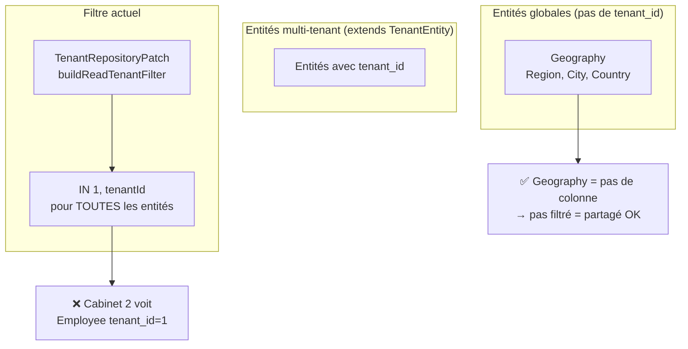
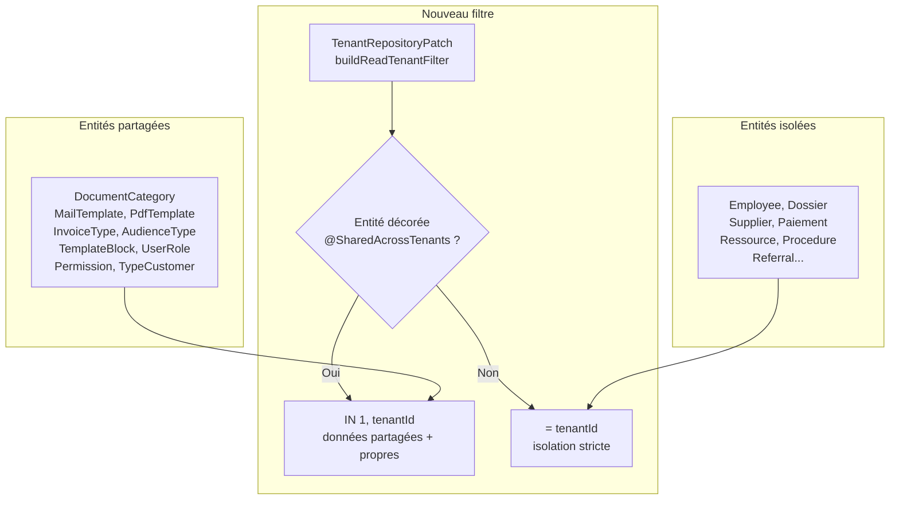

# Plan : Isolation stricte des données par cabinet (tenant)

## Problème

Actuellement, la fonction [`buildReadTenantFilter`](src/core/tenant/tenant-repository.patch.ts:47) utilise `IN (1, tenantId)` pour TOUTES les entités qui ont une colonne `tenant_id`. Cela signifie qu'un cabinet (`tenant_id = 2`) voit :

- Ses propres données (`tenant_id = 2`) ✅
- Les données du tenant global (`tenant_id = 1`) ❌ pour les entités métier (employés, dossiers...)

**Conséquence** : un cabinet voit les employés/dossiers des autres cabinets qui ont été créés avec `tenant_id = 1` par défaut.

---

## Architecture multi-tenant actuelle



---

## Solution proposée : Décorateur `@SharedAcrossTenants()`

### Principe

1. **Comportement par défaut** : isolation stricte → `WHERE tenant_id = X` (un cabinet ne voit QUE ses propres données)
2. **Décorateur optionnel** `@SharedAcrossTenants()` sur les entités qui DOIVENT être partagées → `WHERE tenant_id IN (1, X)`

### Nouveau comportement



### Fichiers à modifier

| Fichier | Action |
|---------|--------|
| [`src/core/tenant/tenant-repository.patch.ts`](src/core/tenant/tenant-repository.patch.ts) | Modifier `buildReadTenantFilter` pour vérifier le décorateur |
| [`src/core/tenant/`](src/core/tenant/) | Créer `tenant.decorator.ts` avec `@SharedAcrossTenants()` |
| Toutes les entités partagées | Ajouter `@SharedAcrossTenants()` |

### Détail des modifications

#### 1. Nouveau fichier : [`src/core/tenant/tenant.decorator.ts`](src/core/tenant/tenant.decorator.ts)

```typescript
import 'reflect-metadata';

export const SHARED_TENANT_KEY = 'shared:tenant';

/**
 * Marque une entité comme partagée entre tous les cabinets.
 * 
 * Les entités SANS ce décorateur appliquent un filtre strict :
 *   WHERE tenant_id = X
 * 
 * Les entités AVEC ce décorateur utilisent un filtre IN :
 *   WHERE tenant_id IN (1, X)
 * 
 * Usage :
 *   @SharedAcrossTenants()
 *   @Entity('document_category')
 *   export class DocumentCategory extends TenantEntity { ... }
 */
export function SharedAcrossTenants(): ClassDecorator {
    return (target) => {
        Reflect.defineMetadata(SHARED_TENANT_KEY, true, target);
    };
}

/**
 * Vérifie si une classe d'entité est marquée comme partagée.
 */
export function isSharedEntity(target: Function): boolean {
    return !!Reflect.getMetadata(SHARED_TENANT_KEY, target);
}
```

#### 2. Modification de [`src/core/tenant/tenant-repository.patch.ts`](src/core/tenant/tenant-repository.patch.ts)

Dans la fonction `buildReadTenantFilter` (ligne 47), ajouter le paramètre `metadata` et la vérification :

```typescript
// AVANT (ligne 47-49)
function buildReadTenantFilter(tenantId: number): any {
    return tenantId === 1 ? 1 : In([1, tenantId]);
}

// APRÈS
function buildReadTenantFilter(metadata: any, tenantId: number): any {
    const isShared = metadata?.target 
        ? isSharedEntity(metadata.target)
        : false;
    if (isShared) {
        // Entité partagée : données globales + propres
        return tenantId === 1 ? 1 : In([1, tenantId]);
    }
    // Entité à isolation stricte : uniquement ses propres données
    return tenantId;
}
```

Mettre à jour l'appel dans `mergeTenantWhere` (ligne 55) :
```typescript
// AVANT
const tenantFilter = buildReadTenantFilter(tenantId);
// APRÈS
const tenantFilter = buildReadTenantFilter(metadata, tenantId);
```

#### 3. Mettre à jour [`addTenantCondition`](src/core/tenant/tenant-repository.patch.ts:224)

Pour le helper QueryBuilder, il faut aussi pouvoir détecter si l'entité est partagée :

```typescript
// AVANT (ligne 232-237)
if (tenantId === 1) {
    return qb.andWhere(`${alias}.tenant_id = :_tenantId`, { _tenantId: tenantId });
}
return qb.andWhere(`${alias}.tenant_id IN (:..._tenantIds)`, { _tenantIds: [1, tenantId] });

// APRÈS
const entityTarget = qb.expressionMap.mainAlias?.metadata?.target;
const isShared = entityTarget ? isSharedEntity(entityTarget) : false;

if (isShared) {
    // Entité partagée
    if (tenantId === 1) {
        return qb.andWhere(`${alias}.tenant_id = :_tenantId`, { _tenantId: tenantId });
    }
    return qb.andWhere(`${alias}.tenant_id IN (:..._tenantIds)`, { _tenantIds: [1, tenantId] });
}
// Entité à isolation stricte
return qb.andWhere(`${alias}.tenant_id = :_tenantId`, { _tenantId: tenantId });
```

#### 4. Ajouter `@SharedAcrossTenants()` aux entités partagées

Liste des entités à décorer (données de référence partagées entre cabinets) :

| Entité | Fichier |
|--------|---------|
| [`DocumentCategory`](src/modules/document-category/entities/document-category.entity.ts) | Ajouter `@SharedAcrossTenants()` |
| [`MailTemplate`](src/modules/mail-template/entities/mail-template.entity.ts) | Ajouter `@SharedAcrossTenants()` |
| [`PdfTemplate`](src/modules/pdf-templates/entities/pdf-template.entity.ts) | Ajouter `@SharedAcrossTenants()` |
| [`InvoiceType`](src/modules/invoice-type/entities/invoice-type.entity.ts) | Ajouter `@SharedAcrossTenants()` |
| [`AudienceType`](src/modules/audience-type/entities/audience-type.entity.ts) | Ajouter `@SharedAcrossTenants()` |
| [`TemplateBlock`](src/modules/template-blocks/entities/template-block.entity.ts) | Ajouter `@SharedAcrossTenants()` |
| [`UserRole`](src/modules/iam/user-role/entities/user-role.entity.ts) | Ajouter `@SharedAcrossTenants()` |
| [`Permission`](src/modules/iam/permission/entities/permission.entity.ts) | Ajouter `@SharedAcrossTenants()` |
| [`RolePermission`](src/modules/iam/role-permission/entities/role-permission.entity.ts) | Ajouter `@SharedAcrossTenants()` |
| [`TypeCustomer`](src/modules/customer/type-customer/entities/type_customer.entity.ts) | Ajouter `@SharedAcrossTenants()` |
| [`RessourceType`](src/modules/ressource/ressource-type/entities/ressource-type.entity.ts) | Ajouter `@SharedAcrossTenants()` |

---

## Tests de validation

1. **Cabinet 2** recherche des employés → ne voit QUE les employés avec `tenant_id = 2`
2. **Cabinet 2** recherche des `DocumentCategory` → voit ceux avec `tenant_id = 1` ET `tenant_id = 2`
3. **Cabinet 1** (admin global) voit toutes ses données (`tenant_id = 1`)
4. **Geography** (pas de `tenant_id`) reste accessible à tous les cabinets
5. **Script/Migration** (hors contexte HTTP) → pas de filtre tenant, accès complet

---

## Ordre d'exécution

1. Créer [`src/core/tenant/tenant.decorator.ts`](src/core/tenant/tenant.decorator.ts) avec `@SharedAcrossTenants()` et `isSharedEntity()`
2. Modifier `buildReadTenantFilter` dans [`tenant-repository.patch.ts`](src/core/tenant/tenant-repository.patch.ts)
3. Modifier `addTenantCondition` dans [`tenant-repository.patch.ts`](src/core/tenant/tenant-repository.patch.ts)
4. Ajouter `@SharedAcrossTenants()` à toutes les entités partagées (liste ci-dessus)
5. Tester la régression : les Geography (sans tenant_id) sont toujours accessibles
